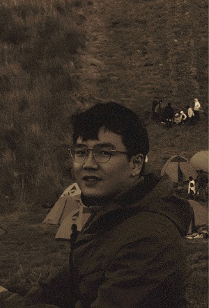

# Nuowen Kan (阚诺文)

Third-year __Ph.D. candidate__

in Department of Computer Science and Engineering

[Shanghai Jiao Tong University (SJTU)](https://www.sjtu.edu.cn/), China. 

I'm also a member of [Media, Information and Network](http://min.sjtu.edu.cn/) group.

__Previouly:__ I received the B.S. degree in Information Engineering from Nanjing University of Aeronautics and Astronautics, China, in 2017, and the M.S. degree in Electronics and Communications Engineering from SJTU, China, in 2020.  

## Research Interest

- The application of deep learning in multimedia and network flow optimization
- Deep reinforcement learning and Graph neural network
- Task oriented image/video processing and communication

## Contact

* Email: kannw_1230 [at] sjtu [dot] edu [dot] cn
* [Google Scholar](https://scholar.google.com/citations?user=OKrLi6UAAAAJ&hl)
* [Github](https://github.com/confiwent)
* [Linkin](https://www.linkedin.com/in/%E8%AF%BA%E6%96%87-%E9%98%9A-763004119/)

> Shanghai Jiao Tong University (SJTU)
> 
> 800 Dongchuan Road, Minhang District
>
> Shanghai, 200240
>
> P.R. China

<!-- > Rm. 307, No.1 SEIEE Buliding, 
>
> Shanghai Jiao Tong University (SJTU)
>
> 800 Dongchuan Road, Minhang District
>
> Shanghai, 200240
>
> P.R. China -->

---

## LAB 

[Institute of Media, Information and Network](http://min.sjtu.edu.cn/index.htm)

