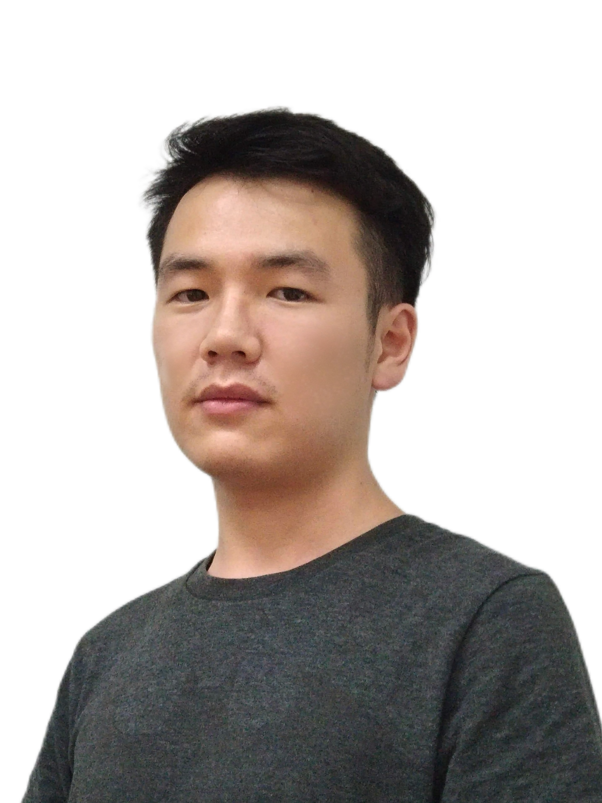

# Nuowen Kan (阚诺文)

## <i class="fa-solid fa-id-card"></i> About me
Postdoctoral Researcher

[Media, Information, and Network](http://min.sjtu.edu.cn/) group, Shanghai Jiao Tong University (SJTU). 

I am a postdoctoral researcher in the department of Electronic Engineering, SJTU, and will join East China Normal University (ECNU) in March, 2026. I received my Ph.D. degree in Computer Science from SJTU, in 2024, the B.S. degree in Information Engineering from Nanjing University of Aeronautics and Astronautics, China, and the M.S. degree in Electronics and Communications Engineering from SJTU.  

My current research focuses include:
- AI for multimedia communication and network optimization
- LLM Infra (collective communication/compute-communication overlapping/inference serving)
- Deep reinforcement learning and vision-language-action (VLA) model
<!-- - Task oriented image/video processing and communication -->

## <i class="fa-solid fa-radio"></i> Recent News
- _[Aug. 2025]_ Our paper titled "[MERINA+: Improving Generalization for Neural Video Adaptation via Information-Theoretic Meta-Reinforcement Learning](https://ieeexplore.ieee.org/document/11119689)" was accepted by IEEE Transactions on Circuits and Systems for Video Technology (TCSVT), 2025!

- _[Aug. 2025]_ Our paper titled "[Point Cloud Attribute Compression with Geometry-Aware Lifting-Based Multiscale Networks](https://ieeexplore.ieee.org/document/11121912)" was accepted by IEEE Transactions on Circuits and Systems for Video Technology (TCSVT), 2025!

- _[July. 2025]_ Our paper titled "[3DGabSplat: 3D Gabor Splatting for Frequency-adaptive Radiance Field Rendering](https://dl.acm.org/doi/abs/10.1145/3746027.3754855)" was accepted by ACM Multimedia, 2025!

- _[May. 2025]_ Our paper titled "[Noise Conditional Variational Score Distillation](https://icml.cc/virtual/2025/poster/45111)" was accepted by International Conference on Machine Learning (ICML), 2025!

<!-- - _[Apr. 2025]_ Our paper titled "A Generalizable and Expressive Meta-Diffusion Policy for RTC Bandwidth Prediction" was accepted by IEEE International Conference on Multimedia&Expo (ICME), 2025! -->

- _[Mar. 2025]_ Our paper titled "[Stabilizing and Accelerating Autofocus with Expert Trajectory Regularized Deep Reinforcement Learning](https://cvpr.thecvf.com/virtual/2025/poster/35124)" was accepted by IEEE/CVF Conference on Computer Vision and Pattern Recognition (CVPR), 2025!

- _[Feb. 2025]_ Our paper titled "[On Disentangled Training for Nonlinear Transform in Learned Image Compression](https://openreview.net/forum?id=U67J0QNtzo)" was accepted by International Conference on Learning Representations (ICLR), 2025!

<!-- - [Jan. 2025] Our paper titled "GDPlan: Generative Network Planning via Graph Diffusion Model" was accepted by IEEE/ACM Transactions on Networking (ToN), 2025!

- [Jan. 2025] Our paper titled "Task-Adapted Learnable Embedded Quantization for Scalable Human-Machine Image Compression" was accepted by IEEE Transactions on Circuits and Systems for Video Technology (TCSVT), 2025! -->

<!-- - [Sep. 2024] Our paper titled "Improving Generalization in Federated Learning with Model-Data Mutual Information Regularization: A Posterior Inference Approach" was accepted by NeurIPS, 2024!

- [Jul. 2024] Our paper titled "Task-Oriented Multi-Bitstream Optimization for Image Compression and Transmission via Optimal Transport" was accepted by ACM Multimedia, 2024!

- [Oct. 2023] Our paper titled "Successor Feature-Based Transfer Reinforcement Learning for Video Rate Adaptation with Heterogeneous QoE Preferences" was accepted by IEEE Transactions on Multimedia (TMM), 2023!

- [Sep. 2023] Our paper titled "Doubly Robust Augmented Transfer for Meta-Reinforcement Learning" was accepted by NeurIPS 2023!

- [Oct. 2022] Our paper titled "Improving Generalization for Neural Adaptive Video Streaming via Meta Reinforcement Learning" was honored with the **Top Paper Award** by ACM Multimedia 2022! -->

## <i class="fa-solid fa-award"></i> Honors and Awards

<!-- - **Science and Technology Advancement Award-First Prize, Shanghai**, 2022. -->
- China National Postdoctoral Program for Innovative
Talents (中国博士后创新人才支持计划), 2025
- Shanghai Super Postdoctoral Program (上海市超级博士后计划), 2024
- Outstanding Ph.D. Graduate of Shanghai, 2024
- Second Class Prize, Chinese Institute of Electronics Scientific and Technological Progress Award (Rank: 4/9), 2023
- ACM Multimedia Top Paper Award (first author), 2022
- Huawei Scholarship, 2022.
- SMICS MengNing Scholarship, 2019.
- National Encourage Scholarship, 2016.
- FPGA Application System Design Invitational Competition-First Prize, Jiangsu, 2015.

## <i class="fa-brands fa-teamspeak"></i> Services
*Reviewer* for 
- Journals: IEEE JSAC, IEEE TMM, IEEE TCSVT, IEEE TMC
- Conferences: NeurIPS 2025, ICLR 2025，ACM Multimedia 2022, 2023, 2024, IEEE ICC 2023, 2024, IEEE WCNC 2023.

---

## <i class="fa-solid fa-address-book"></i> Contact

* Email: kannw_1230 [at] sjtu [dot] edu [dot] cn
* [Google Scholar](https://scholar.google.com/citations?user=OKrLi6UAAAAJ&hl)
* [Github](https://github.com/confiwent)
<!-- * [Linkin](https://www.linkedin.com/in/%E8%AF%BA%E6%96%87-%E9%98%9A-763004119/) -->

<!-- > Shanghai Jiao Tong University (SJTU)
> 
> 800 Dongchuan Road, Minhang District
>
> Shanghai, 200240
>
> P.R. China -->

<!-- > Rm. 307, No.1 SEIEE Buliding, 
>
> Shanghai Jiao Tong University (SJTU)
>
> 800 Dongchuan Road, Minhang District
>
> Shanghai, 200240
>
> P.R. China -->

<!-- ## LAB 

[Institute of Media, Information and Network](https://min.sjtu.edu.cn)
 -->
