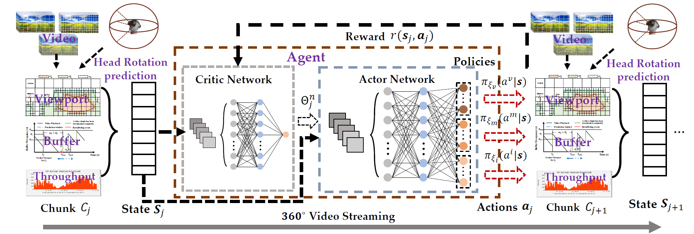
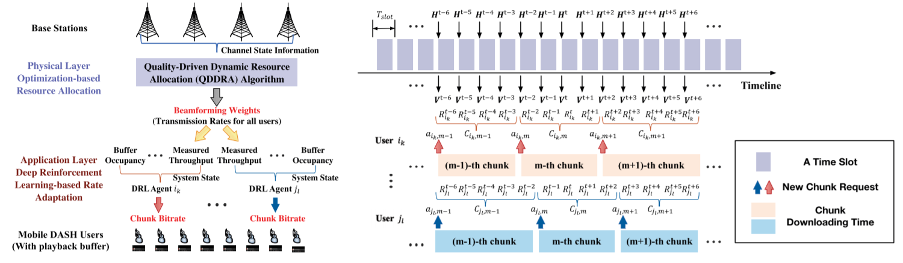
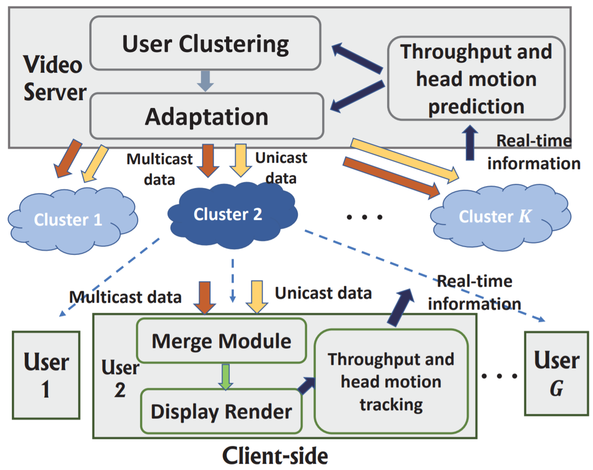
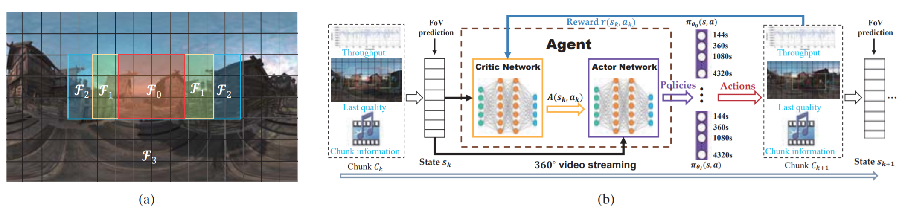
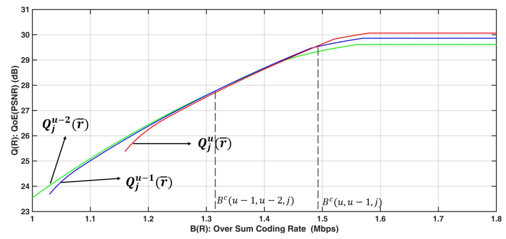

# Publications

- **[IEEE TMM] Successor Feature-Based Transfer Reinforcement Learning for Video Rate Adaptation with Heterogeneous QoE Preferences**

    Kexin Tang, <u>Nuowen Kan</u>, Yuankun, Jiang, Chenglin Li, Wenrui Dai, Junni Zou, Hongkai Xiong

    Accepted by IEEE Transactions on Multimedia, 2023.

- **[NeurIPS] Doubly Robust Augmented Transfer for Meta-Reinforcement Learning**

  Yuankun Jiang, <u>Nuowen Kan</u>, Chenglin Li, Wenrui Dai, Junni Zou, Hongkai Xiong

  Accepted by Thirty-seventh Conference on Neural Information Processing Systems, 2023.

- **[ACM Multimedia] Improving Generalization for Neural Adaptive Video Streaming via Meta Reinforcement Learning**
  
  <u>Nuowen Kan</u>, Yuankun Jiang, Chenglin Li, Wenrui Dai, Junni Zou, Hongkai Xiong

  In the 30th ACM International Conference on Multimedia, 2022.

  <!-- __Top Papers Award (Top 6/609)__ -->
  __Oral Presentation, Top Papers Award (Top 6/609)__

  [\[Paper\]](https://dl.acm.org/doi/abs/10.1145/3503161.3548331) [\[Code\]](https://github.com/confiwent/merina) [\[Framework\]](pic/MM_22.png) 

<!--  -->

- **[ACM NOSSDAV] Uncertainty-Aware Robust Adaptive Video Streaming with Bayesian Neural Network and Model Predictive Control**
  
  <u>Nuowen Kan</u>, Chenglin Li, Caiyi Yang, Wenrui Dai, Junni Zou, Hongkai Xiong

  In the 31st ACM Workshop on Network and Operating Systems Support for Digital Audio and Video, 2021.

  Oral Presentation

  [\[Paper\]](https://dl.acm.org/doi/abs/10.1145/3458306.3458872)[\[Code\]](https://github.com/confiwent/BayesMPC) [\[Framework\]](pic/nossdav'21.png)

<!--  -->

- **[IEEE TCSVT] RAPT360: Reinforcement Learning-Based Rate Adaptation for 360-degree Video Streaming with Adaptive Prediction and Tiling**

    <u>Nuowen Kan</u>, Junni Zou, Chenglin Li, Wenrui Dai, Hongkai Xiong

    In IEEE Transactions on Circuits and Systems for Video Technology, Vol. 32(3), March 2022.

    [\[Paper\]](https://ieeexplore.ieee.org/document/9419061?reason=concurrency)[\[Framework\]](pic/tcsvt_21.png)

<!--  -->

- **[IEEE TCSVT] Multi-user Adaptive Video Delivery over Wireless Networks: A Physical Layer Resource-Aware Deep Reinforcement Learning Approach**

    Kexin Tang, <u>Nuowen Kan</u>, Junni Zou, Chenglin Li, Xiao Fu, Mingyi Hong, Hongkai Xiong

    In IEEE Transactions on Circuits and Systems for Video Technology, Vol. 31(2), February 2021.

    [\[Paper\]](https://ieeexplore.ieee.org/abstract/document/9035396) [\[Framework\]](pic/tcsvt_20.png)

<!--  -->

- **[IEEE ICIP] A Server-side Optimized Hybrid Multicast-Unicast Strategy for Multi-User Adaptive 360-Degree Video Streaming**

    <u>Nuowen Kan</u>, Chengming Liu, Junni Zou, Chenglin Li, Hongkai Xiong

    In 2019 IEEE International Conference on Image Processing.

    Oral Presentation

    [\[Paper\]](https://ieeexplore.ieee.org/abstract/document/8803007) [\[Framework\]](pic/icip_19.png) [\[Slice\]](https://drive.google.com/file/d/1y6tLxdk-TxEl9gnDd-EnFSwyXgHnoUKQ/view?usp=sharing)

<!--  -->

- **[IEEE ICASSP] Deep Reinforcement Learning-based Rate Adaptation for Adaptive 360-degree Video Streaming**

    <u>Nuowen Kan</u>, Junni Zou, Kexin Tang, Chenglin Li, Ning Liu, Hongkai Xiong

    In 2019 IEEE International Conference on Acoustics, Speech and Signal Processing.

    [\[Paper\]](https://ieeexplore.ieee.org/document/8683779) [\[Poster\]](https://drive.google.com/file/d/1ZXA_Ut1n-HMu7117lQNG4i1EIK-ACOii/view?usp=sharing)

<!--  -->

- **[IEEE ICIP] Server-side Rate Adaptation for Multi-User 360-Degree Video Streaming**

    Chengming Liu, <u>Nuowen Kan</u>, Junni Zou, Qin Yang, Hongkai Xiong

    In 2018 IEEE International Conference on Image Processing.

    [\[Paper\]](https://ieeexplore.ieee.org/document/8451447)
